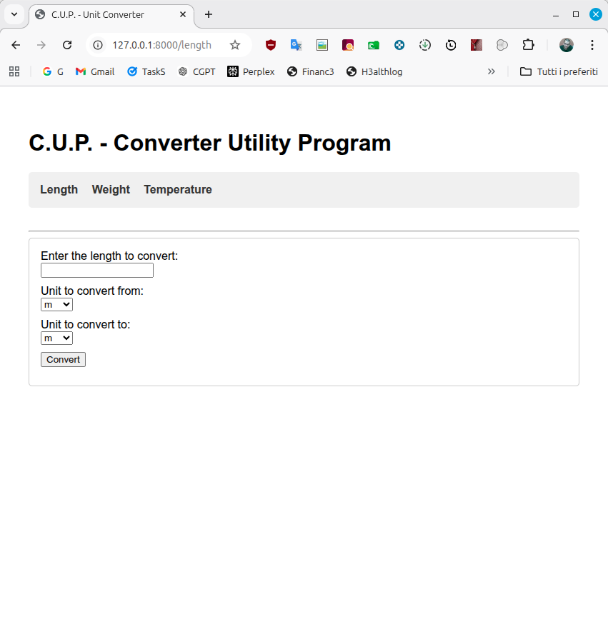

# C.U.P. - Convert Units Please

A simple, fast, and efficient unit converter web application built with **Python** and **FastAPI**.



( a roadmap.sh project : https://roadmap.sh/projects/unit-converter )

## Features

- **Length Conversion**: Meters, Kilometers, Feet, Miles, Inches, Yards, etc.
- **Weight Conversion**: Kilograms, Grams, Pounds, Ounces, etc.
- **Temperature Conversion**: Celsius, Fahrenheit, Kelvin.
- **Web Interface**: Server-side rendered HTML using Jinja2 templates.

## Installation

1.  **Clone the repository** (or download the source code):

    ```bash
    cd cup
    ```

2.  **Set up the virtual environment**:

    ```bash
    python -m venv venv
    source venv/bin/activate  # On Windows use: venv\Scripts\activate
    ```

3.  **Install dependencies**:
    ```bash
    pip install "fastapi[standard]" jinja2
    ```

## Usage

Run the development server:

```bash
fastapi dev main.py
```

Open your browser and visit: **http://127.0.0.1:8000**
